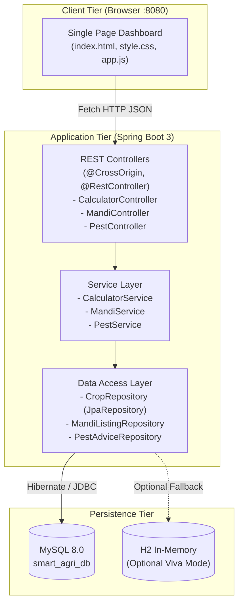

# 🌱 Smart Agriculture Management System

A clean, modular, and beginner-friendly full-stack web application designed for agricultural decision-making and farmer support.

Built with **Java 17, Spring Boot 3, Spring Data JPA, MySQL 8.0**, and a modern **Single-Page Application (SPA)** frontend using HTML5, Vanilla CSS, and JavaScript.

---

## 📌 Project Overview & Key Features

1. **🌾 Fertilizer & Schedule Advisor**:
   - Calculates scientific Nitrogen, Phosphorus, and Potassium (N-P-K) dosage in kg.
   - Tailored to 5 major crops (*Rice, Wheat, Cotton, Maize, Sugarcane*), 5 soil varieties (*Alluvial, Black, Clay, Red, Sandy*), and field acreage.
   - Provides agronomic basal and top-dressing split-dose schedules.

2. **💧 Irrigation Water Calculator**:
   - Computes estimated daily water requirements in Liters using the formula:
     $$\text{Daily Water (L)} = \text{Acreage} \times \text{Growth Stage Factor} \times 1000$$
   - Considers 4 growth stages (*Germination [2.5], Vegetative [4.0], Flowering [6.0], Maturity [3.0]*).
   - Recommends optimal delivery methods (*Drip, Sprinkler, Furrow, AWD*).

3. **🏛️ Mandi Marketplace**:
   - Direct marketplace board for farmers to list harvests: Farmer Name, Crop Variety, Quantity in Quintals, Expected Price (₹/Quintal), Mandi Location, and Contact Number.
   - Real-time Add, View, Search, and Delete operations synced with MySQL.

4. **🛡️ Pest Advisory & Remedies**:
   - Crop symptom diagnostics featuring side-by-side solutions:
     - 🌿 **Biological / Organic Remedy**: Eco-friendly biopesticides and parasitic insects.
     - 🧪 **Chemical Spray Dosage**: Standard agronomic chemical dosage per acre/liter.

---

## 🏗️ Architecture & Data Flow



---

## 🗄️ Database Setup (MySQL Workbench)

### Step 1: Create Database in MySQL Workbench
1. Open **MySQL Workbench** and connect to your local MySQL server.
2. Open a new SQL Query tab (`Ctrl + T`) and execute:
   ```sql
   CREATE DATABASE IF NOT EXISTS smart_agri_db;
   USE smart_agri_db;
   ```

### Step 2: Configure Credentials in `application.properties`
Open `src/main/resources/application.properties` and verify your MySQL password:
```properties
spring.datasource.url=jdbc:mysql://localhost:3306/smart_agri_db?createDatabaseIfNotExist=true&useSSL=false&serverTimezone=UTC&allowPublicKeyRetrieval=true
spring.datasource.username=root
spring.datasource.password=your_mysql_password
```
*(Default configured password is `root`)*.

> [!TIP]
> **Zero-Setup Viva Fallback (H2 Mode)**:
> If MySQL is not installed on your college presentation computer, you can switch to the embedded H2 database in 5 seconds! Simply comment out the MySQL lines in `application.properties` and uncomment the H2 lines. The project will run with zero external software!

---

## 🚀 How to Run the Project

### Option A: 1-Click Startup (Windows)
Double-click the **`run.bat`** file in the project root directory.

### Option B: Using Command Line / Terminal
```bash
# Compile and run with Maven
mvn spring-boot:run
```

### Option C: Using IDE (IntelliJ IDEA / Eclipse / VS Code)
1. Open this folder as a **Maven Project**.
2. Locate `src/main/java/com/agri/smartagri/SmartAgriApplication.java`.
3. Right-click and select **Run 'SmartAgriApplication'**.

### Accessing the Dashboard:
Once the server logs show `Started SmartAgriApplication`, open your web browser and go to:
👉 **`http://localhost:8080`**

---

## 📡 REST API Reference

| Module | Method | Endpoint | Description |
| :--- | :--- | :--- | :--- |
| **Fertilizer** | `POST` | `/api/calculate/fertilizer` | Computes customized N-P-K nutrient dosage |
| **Fertilizer** | `GET` | `/api/calculate/crops` | Returns list of all supported crops from DB |
| **Water** | `POST` | `/api/calculate/water` | Calculates daily irrigation requirements in Liters |
| **Mandi** | `GET` | `/api/mandi` | Fetches all active mandi crop listings |
| **Mandi** | `POST` | `/api/mandi` | Publishes a new crop listing |
| **Mandi** | `DELETE` | `/api/mandi/{id}` | Removes a listing by ID |
| **Pest** | `GET` | `/api/pest` | Returns all pest advisories (supports `?crop=Rice`) |
| **Pest** | `GET` | `/api/pest/search` | Searches remedies by symptom keyword |
| **Pest** | `GET` | `/api/pest/{id}` | Fetches specific pest advice record |

A complete **`postman_collection.json`** is included in the project root for testing.

---

## 🎓 College Viva Q&A Cheat Sheet

Prepare for questions commonly asked by external examiners during project evaluations:

### Q1: Why did you use Spring Boot instead of standard Spring MVC / Servlets?
**Answer:**
Spring Boot eliminates complex XML boilerplate configurations through **Auto-Configuration** and provides an **embedded Tomcat web server**. It enables rapid development through ready-made starter dependencies (`spring-boot-starter-web`, `spring-boot-starter-data-jpa`) so we can package and run a production-ready application with just one command.

---

### Q2: What is Spring Data JPA, and how does it differ from traditional JDBC?
**Answer:**
In plain JDBC, developers must manually write SQL queries, open/close connections, handle exceptions, and map `ResultSet` data into Java objects manually. 
**Spring Data JPA** is built on top of Hibernate (an Object-Relational Mapping framework). It automatically creates CRUD operations at runtime simply by declaring an interface that extends `JpaRepository<Entity, ID>`, drastically reducing boilerplate code and preventing SQL injection.

---

### Q3: How does the Fertilizer Recommendation logic work?
**Answer:**
The system uses agronomic baselines for Nitrogen ($N$), Phosphorus ($P$), and Potassium ($K$) per acre. When the user selects a crop and soil type:
1. The service queries the `crops` database table for specific soil profiles.
2. If custom modifiers exist (e.g., Sandy soil has high leaching, requiring a $1.25\times$ adjustment, whereas Black soil has high retention with $0.90\times$), the dosage is adjusted and multiplied by total acreage.
3. The formula produces the total kg needed and recommends a split schedule (50% basal dose at sowing + 2 top dressings).

---

### Q4: How is the frontend connected without a separate Node.js / React build process?
**Answer:**
Spring Boot automatically serves static content placed inside `src/main/resources/static/`. By placing `index.html`, `style.css`, and `app.js` there, the embedded Tomcat server serves both the user interface and REST APIs on port `8080`. The frontend uses the browser's native `fetch()` API with JSON payloads, completely eliminating CORS issues.

---

### Q5: What is the purpose of the `@CrossOrigin` annotation?
**Answer:**
`@CrossOrigin` enables Cross-Origin Resource Sharing (CORS). It instructs the server to include headers (like `Access-Control-Allow-Origin`) that allow requests originating from other ports or domains (such as a separate frontend dev server, mobile app, or Postman) to safely access the REST endpoints.

---

### Q6: What happens during the deletion of a Mandi listing?
**Answer:**
When the user clicks "Delete" on the table, `app.js` issues an asynchronous `DELETE` HTTP request to `/api/mandi/{id}`. In the backend, `MandiController` invokes `MandiService.deleteListing(id)`, which verifies existence using `mandiListingRepository.existsById(id)` and triggers `deleteById(id)`. Upon receiving a 200 OK response, the frontend refreshes the table instantly.

---

## 📂 Project Structure

```
SmartAgri/
├── pom.xml
├── run.bat
├── postman_collection.json
├── README.md
└── src/
    └── main/
        ├── java/com/agri/smartagri/
        │   ├── SmartAgriApplication.java
        │   ├── controller/
        │   │   ├── CalculatorController.java
        │   │   ├── MandiController.java
        │   │   └── PestController.java
        │   ├── dto/
        │   │   ├── FertilizerRequest.java
        │   │   ├── FertilizerResponse.java
        │   │   ├── WaterRequest.java
        │   │   └── WaterResponse.java
        │   ├── model/
        │   │   ├── Crop.java
        │   │   ├── MandiListing.java
        │   │   └── PestAdvice.java
        │   ├── repository/
        │   │   ├── CropRepository.java
        │   │   ├── MandiListingRepository.java
        │   │   └── PestAdviceRepository.java
        │   └── service/
        │       ├── CalculatorService.java
        │       ├── MandiService.java
        │       └── PestService.java
        └── resources/
            ├── application.properties
            ├── schema.sql
            ├── data.sql
            └── static/
                ├── index.html
                ├── style.css
                └── app.js
```
